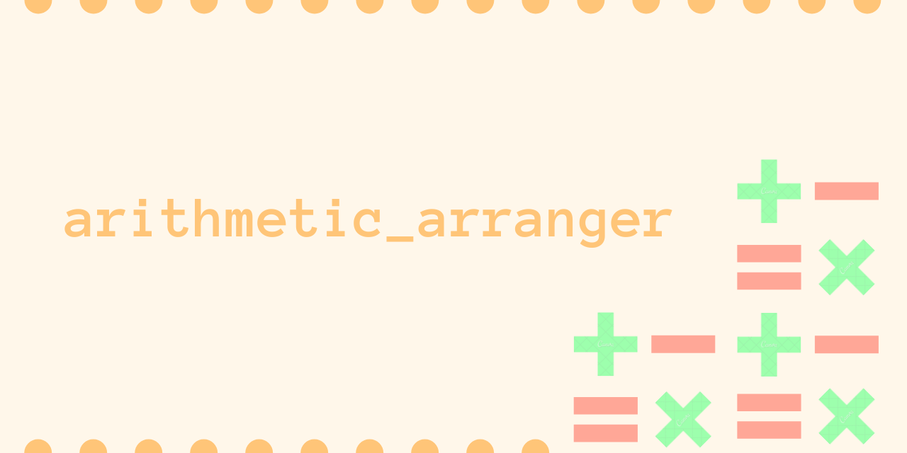

### About this project

This project is from freeCodeCamp's Scientific Computing with Python Certificate. This repository contains the prompt for the project as well as my solution for the assignment. 

To run my arithmetic_arranger code with the tests provided by freeCodeCamp for this project, feel free to visit [my replit](https://replit.com/@NataliaRosado1/arithmetic-formatter).


### Assignment

Students in primary school often arrange arithmetic problems vertically to make them easier to solve. For example, "235 + 52" becomes:
```
  235
+  52
-----
```

Create a function that receives a list of strings that are arithmetic problems and returns the problems arranged vertically and side-by-side. The function should optionally take a second argument. When the second argument is set to `True`, the answers should be displayed.

### For example

Function Call:
```py
arithmetic_arranger(["32 + 698", "3801 - 2", "45 + 43", "123 + 49"])
```

Output:
```
   32      3801      45      123
+ 698    -    2    + 43    +  49
-----    ------    ----    -----
```

Function Call:
```py
arithmetic_arranger(["32 + 8", "1 - 3801", "9999 + 9999", "523 - 49"], True)
```

Output:
```
  32         1      9999      523
+  8    - 3801    + 9999    -  49
----    ------    ------    -----
  40     -3800     19998      474
```

### Rules

The function will return the correct conversion if the supplied problems are properly formatted, otherwise, it will **return** a **string** that describes an error that is meaningful to the user.


* Situations that will return an error:
  * If there are **too many problems** supplied to the function. The limit is **five**, anything more will return:
    `Error: Too many problems.`
  * The appropriate operators the function will accept are **addition** and **subtraction**. Multiplication and division will return an error. Other operators not mentioned in this bullet point will not need to be tested. The error returned will be:
    `Error: Operator must be '+' or '-'.`
  * Each number (operand) should only contain digits. Otherwise, the function will return:
    `Error: Numbers must only contain digits.`
  * Each operand (aka number on each side of the operator) has a max of four digits in width. Otherwise, the error string returned will be:
    `Error: Numbers cannot be more than four digits.`
*  If the user supplied the correct format of problems, the conversion you return will follow these rules:
    * There should be a single space between the operator and the longest of the two operands, the operator will be on the same line as the second operand, both operands will be in the same order as provided (the first will be the top one and the second will be the bottom.
    * Numbers should be right-aligned.
    * There should be four spaces between each problem.
    * There should be dashes at the bottom of each problem. The dashes should run along the entire length of each problem individually. (The example above shows what this should look like.)

### My solution

```
def arithmetic_arranger(problems, show_answers=False):
    
    if len(problems) > 5:
        return "Error: Too many problems."
    
    operand_1 = []
    operand_2 = []
    operators = []
    
    for problem in problems:
        operand_1.append(problem.split()[0])
        operand_2.append(problem.split()[2])
        operators.append(problem.split()[1])
        
    for op in operators:
        if op != '+' and op != '-':
            return "Error: Operator must be '+' or '-'."
        
    for operand in operand_1:
        if operand.isnumeric() == False:
            return "Error: Numbers must only contain digits."
        if len(operand) > 4:
            return "Error: Numbers cannot be more than four digits."
        
    for operand in operand_2:
        if operand.isnumeric() == False:
            return "Error: Numbers must only contain digits."  
        if len(operand) > 4:
            return "Error: Numbers cannot be more than four digits."
      
    op_1_new = []
    for i in range(0, len(problems)):
        if len(operand_2[i]) > len(operand_1[i]):
            op_1_new.append(operand_1[i].rjust(len(operand_2[i]) + 2))
        else:
            op_1_new.append(operand_1[i].rjust(len(operand_1[i]) + 2))
            
    op_2_new = []
    for i in range(0, len(problems)):
        if len(operand_1[i]) > len(operand_2[i]):
            op_2_new.append(operand_2[i].rjust(len(operand_1[i])))
        else:
            op_2_new.append(operand_2[i]) 
            
    for j in range(0, len(problems)):
        op_2_new[j] = ' '.join((operators[j], op_2_new[j]))
    
    dashes = []
    for k in range(0, len(problems)):
        dash_val = '-' * len(op_2_new[k])
        dashes.append(dash_val)
        
    # Calculate answers only if show_answers == True
    if show_answers == True:
        
        num_1 = []
        num_2 = []
        answers = []
        answers_2 = []
        
        for op in operand_1:
            num_1.append(int(op))
            
        for op in operand_2:
            num_2.append(int(op))
        
        for i in range(0, len(problems)):
            if operators[i] == '+':
                answers.append(num_1[i] + num_2[i])
            else:
                answers.append(num_1[i] - num_2[i])
                
        for a in answers:
            answers_2.append(str(a))
                
        ans_new = []
        for k in range(0, len(problems)):   
            ans_new.append(answers_2[k].rjust(len(dashes[k])))
        
        ans_line = '    '.join(ans_new)
    
    top_line = '    '.join(op_1_new)
    bot_line = '    '.join(op_2_new)
    dash_line = '    '.join(dashes)
    
    if show_answers == True:
        arranged_problems = '\n'.join([top_line, bot_line, dash_line, ans_line])
    else:
        arranged_problems = '\n'.join([top_line, bot_line, dash_line])
        
    return arranged_problems
